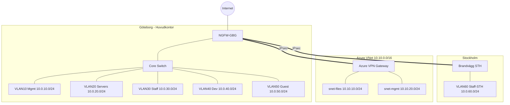

# Designrapport  
## NordTech Solutions AB  

Grupp: Jacob, Jamie, Mohamad  
Datum: 2026-02-24  
Mottagare: Erik Bergström (IT-chef)  

---

# 1. Executive summary

NordTechs nuvarande nätverk saknar segmentering och central brandvägg. All trafik passerar idag samma nät utan kontroll, och distansarbete använder PPTP som har kända säkerhetsbrister. Ett intrång eller ett fel kan därför påverka hela verksamheten.

Vi föreslår en ny nätverksdesign med fem VLAN-zoner, en Next-Generation Firewall (NGFW) med IPS och applikationskontroll, moderna VPN-lösningar (IPsec site-to-site och SSL/IKEv2 med MFA för fjärråtkomst) samt flytt av filserver till Azure som hybridlösning.

Lösningen minskar säkerhetsrisker, ökar tillgänglighet och skapar en stabil grund för framtida Zero Trust-implementation.

Beräknad projekttid är 6 veckor.  
Grov budget: 350 000 kr.  

Vi behöver ert godkännande av budget och tidplan för att påbörja implementationen.

---

# 2. Bakgrund

NordTech Solutions AB är ett IT-konsultföretag med 85 anställda.  
Göteborg är huvudkontor med 60 anställda.  
Stockholm är filialkontor med 25 anställda.

Nuvarande situation:

- Platt nätverksstruktur (ett VLAN)
- Ingen central brandvägg
- PPTP för distansarbete
- Ingen WiFi-planering
- Minimal dokumentation
- Ingen övervakning
- Fysisk filserver utan redundans

Risker med nuläget:

- Ett intrång kan spridas till hela nätverket
- VPN kan komprometteras
- Hårdvarufel kan orsaka dataförlust
- Driftstopp påverkar båda kontoren

NordTech har bett oss ta fram en modern, säker och skalbar nätverksdesign inför flytten till nya lokaler i Göteborg.

---

# 3. Föreslagen nätverksdesign

## 3.1 VLAN-struktur

Vi delar upp nätverket i följande zoner:

- VLAN 10 – Management
- VLAN 20 – Servers
- VLAN 30 – Staff-GBG
- VLAN 40 – Development
- VLAN 50 – Guest
- VLAN 60 – Staff-STH

Motivering:

- Gästnät isoleras för att skydda interna resurser
- Dev separeras från produktion
- Management isoleras för att skydda nätverksutrustning
- Segmentering minskar attackyta

All inter-VLAN-trafik passerar NGFW där policy och loggning tillämpas.

---

## 3.2 Brandvägg

Vi placerar en NGFW mellan internet och interna zoner.

Den ansvarar för:

- Internetfiltrering
- Intrångsskydd (IPS)
- Applikationskontroll
- Inter-VLAN-routing
- VPN-terminering

Vi använder "default deny"-princip mellan zoner.

---

## 3.3 VPN-lösning

### Site-to-site (Göteborg–Stockholm)

- IPsec VPN mellan brandväggarna
- Krypterad trafik mellan kontoren
- Övervakning med larm

### Fjärråtkomst

- SSL/IKEv2 VPN
- MFA
- Rollbaserad åtkomst

PPTP avvecklas helt.

---

## 3.4 WiFi-design

- Separat Staff och Guest SSID
- WPA2/WPA3-Enterprise för Staff
- Site survey före installation
- Central hantering av accesspunkter
- Guest isoleras och når endast internet

---

# 4. Säkerhetslösningar

## 4.1 Brandväggsprinciper

- Default deny mellan VLAN
- Endast nödvändig trafik tillåts
- Loggning av säkerhetsrelaterad trafik
- Separata regler för admin-access

## 4.2 Åtkomsthantering

- MFA för fjärråtkomst
- Bastion-host i serverzonen
- Identitetsbaserad WiFi-inloggning

## 4.3 Zero Trust-förberedelse

Designen möjliggör framtida:

- Enhetshälsokontroll
- Applikationsbaserad åtkomst
- SASE-integration

---

# 5. Molnstrategi

Vi flyttar filserver till Azure som hybridlösning.

Fördelar:

- Automatisk backup
- Högre tillgänglighet
- Skalbar lagring
- Minskad risk vid hårdvarufel

Azure ansluts via IPsec VPN Gateway.

---

# 6. Nätverksdiagram

---

# 7. IP-adressplan

## 7.1 VLAN

| VLAN | Namn | Subnät | Gateway | DHCP | Användning |
|------|------|--------|---------|------|------------|
| 10 | Mgmt | 10.0.10.0/24 | 10.0.10.1 | Statiskt | Nätutrustning |
| 20 | Servers | 10.0.20.0/24 | 10.0.20.1 | Statiskt | Servrar |
| 30 | Staff-GBG | 10.0.30.0/24 | 10.0.30.1 | .50–.250 | Klienter GBG |
| 40 | Dev | 10.0.40.0/24 | 10.0.40.1 | .50–.250 | Utveckling |
| 50 | Guest | 10.0.50.0/24 | 10.0.50.1 | .50–.250 | Gäster |
| 60 | Staff-STH | 10.0.60.0/24 | 10.0.60.1 | .50–.250 | Klienter STH |

## 7.2 Azure

| Subnät | Adress | Användning |
|--------|--------|------------|
| snet-files | 10.10.10.0/24 | Filresurser |
| snet-mgmt | 10.10.20.0/24 | Management |
| GatewaySubnet | 10.10.254.0/27 | VPN Gateway |

---

# 8. Motivering av designval

Vi valde NGFW eftersom NordTech behöver IPS och applikationskontroll. En enkel packet filter-brandvägg räcker inte.

Vi valde IPsec för site-to-site eftersom det är stabilt och standardiserat. PPTP är osäkert och ska inte användas.

Vi valde Azure hybrid eftersom fysisk server utan redundans innebär hög risk. Azure ger backup och skalbarhet.

Alternativ som ExpressRoute ger högre SLA men är dyrare. Vi rekommenderar VPN Gateway då det matchar behov och budget.

---

# 9. Tidplan och nästa steg

## 9.1 Tidplan

| Vecka | Fas |
|--------|------|
| 1 | Planering och design |
| 2 | Förberedelser och konfiguration |
| 3 | Installation i GBG |
| 4 | VPN och WiFi |
| 5 | Azure migrering |
| 6 | Test och driftsättning |

## 9.2 Budget

Total uppskattning: 350 000 kr

## 9.3 Nästa steg

- Godkänna budget
- Godkänna tidplan
- Fastställa förändringsfönster
- Utse intern kontaktperson# nordtech-designrapport
